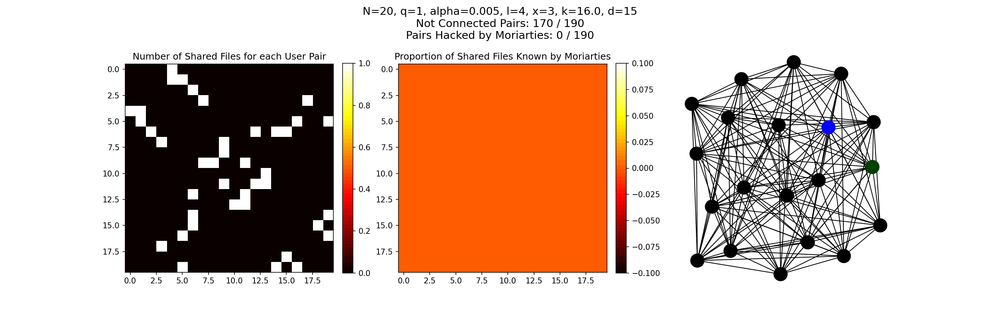
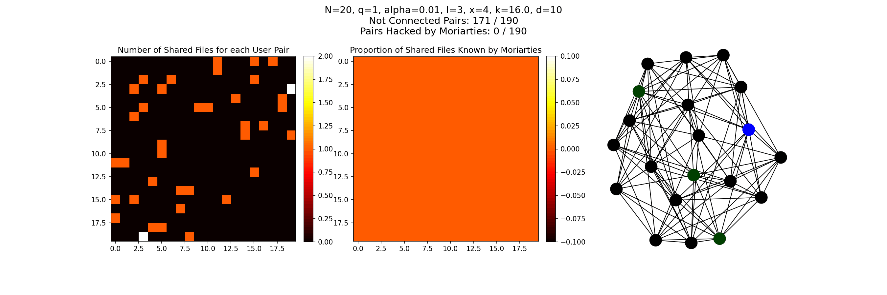
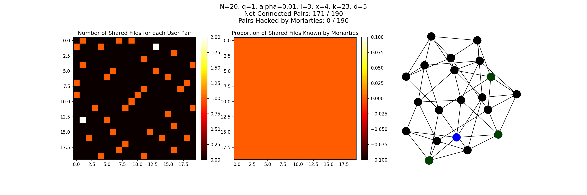

# Кластер Белый Шум. Задание 4.
Аъзам Бехруз, Лишуди Дмитрий

---

## Постановка задачи

* Имеется $N$ пользователей.
* Из них $q$ - Мориарти.
* Среди пользователей распределено M файлов белого шума.
* Любые два пользователя гаммируют передаваемые данные общими файлами белого шума.
* Мориарти могут расшифровать эти данные только если суммарно владеют общими файлами этих двух пользователей.
* Хочется, чтобы вероятность взлома данных была не выше некоторого $\alpha$.
* Требуется по $N, q, \alpha$ найти оптимальное общее количество файлов и алгоритм их распределения.

## Общий алгоритм
Подробные теоретические выкладки доступны в файле [analysis.pdf.](analysis.pdf)
* Фиксируем $N, q, \alpha$; а также желаемое число общих файлов для пар пользователей $\ell$.
* По аналитической формуле или с помощью программного перебора вычисляем оптимальное число файлов $k$, доступных каждому из пользователей.
* Каждый пользователь локально генерирует $x = \lceil \frac{\ell}{N\cdot(1 - \sqrt[q]{1 - \sqrt[\ell]{\alpha}})^2} \rceil$ файлов белого шума.
* Файлы записываются на флешки, после чего итеративно передаются случайным знакомым.
* После $\frac{k}{x} - 1$ передач флешка уничтожается.

Переменные $\alpha$ и $\ell$ дают нам доступ к масштабированиям следующим образом:
* Увеличение $\alpha$ делает систему более безопасной.
* Увеличение $\ell$ увеличивает число пар пользователей, которые могут коммуницировать.
* Такое масштабирование происходит ценой генерации большего числа файлов и большего числа обменов флешками.

## Примеры симуляций
Код экспериментов доступен в ноутбуке [simulations.ipynb.](simulations.ipynb)

Полносвязный случай (все могут передавать всем):

Результат не идеален, но ведь пар всего $N(N-1)/2$. А значит и q в идеале стоит брать $\approx 2/N^2 = 2e-4$. Однако это сильно увеличивает требования по количеству файлов и передач.

Попробуем взять меньшее $N$ и рассматривать регулярные графы со степенью $d$. Здесь случайная вершина выделена синим, остальные вершины становятся тем зеленее, чем больше у них общих файлов с выбранной (максимально зеленый когда общих файлов хотя бы $\ell$).

Для слабосвязного случая (d = 5, можно передавать лишь 25%, других пользователей) картина грустная и по количеству возможных подключений, и по числу взламываемых сообщений. Увеличим $\ell$ и уменьшить $\alpha$:

К сожалению, нужно сильно увеличивать. Похоже, что плохая связность самая большая слабость данного метода - распределение становится сильно неравномерным.
